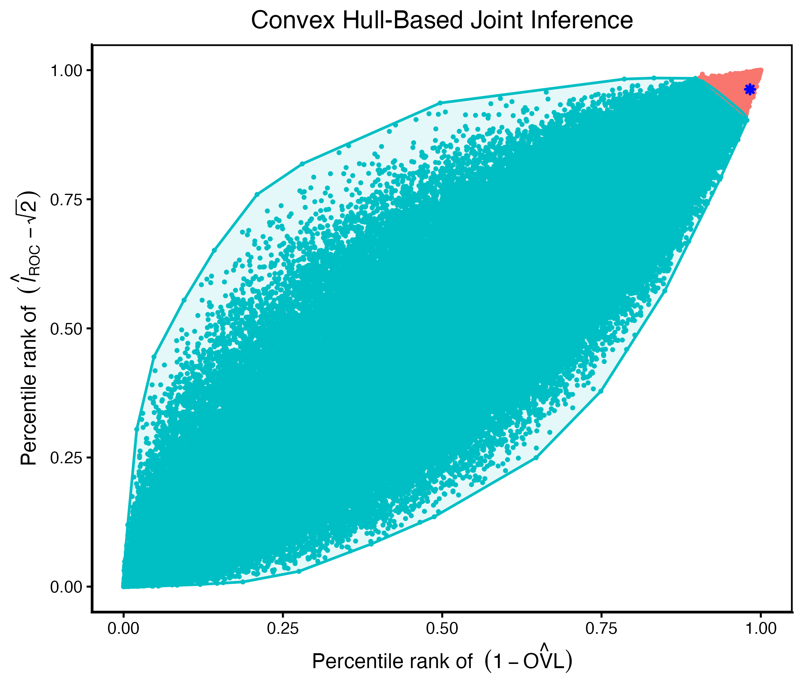

## About the ROCsurvcomp Package

The **ROCsurvcomp** package provides statistical tools for comparing survival distributions under non-proportional hazards (non-PH). Traditional methods such as the log-rank test rely on the proportional hazards assumption and may lose power when this assumption is violated. Alternative approaches, including the Fleming–Harrington family of weighted log-rank tests, often require prior specification of weight functions that depend on the unknown pattern of hazard differences. Incorrect specification of this pattern may lead to a substantial loss of statistical power.

To address these issues, the package implements a novel nonparametric and semiparametric framework for comparing two survival curves based on the length of the ROC curve and the overlap coefficient, along with a joint inference approach that combines both measures. These methods:

- do not require prior knowledge of the underlying hazard patterns
- provide robust power across a wide range of non-PH scenarios (early, late, or crossing effects)
- can accommodate right, left, and doubly censored data
- perform permutation-based inference with two-sided hypothesis testing.

---

## Overview of the Methods

### ROC Length

The first method is based on the length of the Receiver Operating Characteristic (ROC) curve. The ROC curve is one of the most widely used statistical methods for evaluating continuous classifiers that attempt to distinguish between two groups, typically a control group (group 1) and a diseased group (group 2) [@Pepe2003Statistical]. The length of the ROC curve under the biomarker framework has been discussed by @Maswadeh2015Variable, @MartinezCamblor2017ROC, @FrancoPereira2020Biomarker, and @Bantis2021Length.

Let $X_1$ and $X_2$ denote the continuous scores of the classifier for groups 1 and 2, respectively, with survival functions $S_1(\cdot) = 1 - F_1(\cdot)$ and $S_2(\cdot) = 1 - F_2(\cdot)$, where $F_1$ and $F_2$ are the cumulative distribution functions (CDF) of the two groups with a common support. The corresponding probability density functions (PDF) are denoted with $f_1(\cdot)$ and $f_2(\cdot)$. The implied ROC curve is then given by,

\begin{eqnarray}
\text{ROC}(p) = S_2(S_1^{-1}(p)), \quad p \in (0,1). 
\end{eqnarray}

The length of ROC curve, denoted by $l_{\text{ROC}}$, is defined as:

\begin{eqnarray}
    l_{\text{ROC}} = \int_{-\infty}^{\infty} \sqrt{1+\left( \frac{d \text{ROC}(p)}{dp}\right)^2} \, dp = \int_{-\infty}^{\infty} \sqrt{f_1^2(x) + f_2^2(x)} \, dx.
\end{eqnarray}

The range of ROC length is:  $\sqrt{2} \leq l_{\text{ROC}} \leq 2$. The lower bound $\sqrt{2}$ is achieved if and only if the distributions of two groups are exactly identical. On the other hand, $l_{\text{ROC}}=2$ if and only if the two distributions are perfectly separated.

### Overlap Coefficient (OVL)

The second method utilizes the overlap coefficient (OVL), which measures the similarity between two distributions using the common area between two probability density functions [@FrancoPereira2021Overlap]. It was first introduced by @Weitzman1970Measures, and further studied by @Inman1989Overlap, @Reiser1999Confidence, and @Clemmons2000Nonparametric. The overlap area between the density curves of $f_1$ and $f_2$, defined as OVL, is given by,

\begin{eqnarray}
\text{OVL} = \int_{-\infty}^{\infty} \min\left[ f_1(x), f_2(x) \right] \, dx.
\end{eqnarray}

The range of OVL is:  $0 \leq OVL \leq 1$. OVL $=0$ if and only if the distributions of the two groups are completely disjoint, and OVL $=1$ if and only if the two distributions are exactly identical.

### Joint ROC length-OVL-based Method
A joint inference framework is used to combine both ROC length and OVL measures. This method is based on the convex hull of the estimates obtained from permuted samples, constructed using their Euclidean distances from the origin. Before applying this procedure, both measures are standardized to a common scale using their corresponding percentile ranks. Details of this method are provided in Rahman and Bantis (2026, manuscript under review).

### Estimation of ROC-length and OVL
Kernel density estimation is used to estimate the densities of the two underlying groups. A Box-Cox transformation is applied to the data prior to density estimation, as Silverman’s bandwidth (and other similar closed-form bandwidths) is optimized for approximately normal densities. Thus, transforming the data may improve density estimation, especially when Gaussian kernels are involved. In the case of the right-censored data, the kernel density estimator is adjusted by replacing the empirical CDF with the Kaplan-Meier estimator. For left- and doubly censored data, a similar approach is applied using the Turnbull estimator. Moreover, if the last observation is right-censored and/or the first observation is left-censored, censored observations beyond the last and/or before the first ordered uncensored event time are imputed by utilizing the Box-Cox transformed estimated parameters, following the approach described by @Bantis2021Length. Note that imputation is used only to complete the tails and not for the main body of the data.

### Inference Procedure
Let $S_1(t)$ and $S_2(t)$ denote survival probabilities at time $t \geq 0$ for the two groups. The hypothesis to be tested is:

\begin{eqnarray*}
H_0 &:& S_1(t) = S_2(t) \quad \forall t \nonumber \\
H_1 &:& S_1(t) \neq S_2(t). \nonumber
\end{eqnarray*}

Note that the above hypothesis is equivalent to testing $H_0: l_\text{ROC} = \sqrt{2}$ vs. $H_1: l_\text{ROC} \neq \sqrt{2}$ or $H_0: \text{OVL} = 1$ vs. $H_1: \text{OVL} \neq 1$. 

Statistical significance is assessed using a permutation-based test. The estimation procedure described above is applied to obtain $\hat{l}_{ROC}$ and $\hat{OVL}$ from the original sample. To conduct permutation-based testing, all observations from both groups are first pooled into a single dataset. Then, $n_1$ observations are randomly selected without replacement to form group 1 under permutation, and the remaining $n_2$ observations are assigned to group 2. For each permuted sample $p = 1, \ldots,P$, where $P$ denotes the total number of permutations, $\hat{l}^{(p)}_{\text{ROC}}$ and $\hat{OVL}^{(p)}$ are computed using the same estimation procedure.

The null hypothesis is rejected at a nominal level of $5\%$ if the $\hat{l}_\text{ROC}$ is greater than the 95th percentile value of the kernel-based $\hat{l}^{(p)}_{\text{ROC}}$ obtained from $P$ number of permutations. A similar procedure is applied for the OVL-based test. For joint inference using the combination of ROC length and OVL-based methods, the permutation-based pairs $\left( 1 - \hat{OVL}^{(p)}, \hat{l}_{ROC}^{(p)} - \sqrt{2} \right)$ are standardized to a common scale using their corresponding percentile ranks. Then the convex hull is constructed that contains only those pairs of values that fall within the 95th percentile of the Euclidean distance from the origin $(0, 0)$. The null hypothesis is rejected at a nominal level of $5\%$ if the percentile-ranked observed point corresponding to $\left( 1 - \hat{OVL}, \hat{l}_{ROC} - \sqrt{2} \right)$ lies outside the convex hull.

```{r, echo=FALSE, out.width="80%"}

```

---


## `surv.comp()` function

- **Description**
  - This function performs a nonparametric and semiparametric comparison of two survival distributions under right, left, or double censoring using ROC-based metrics, including ROC curve length, overlap coefficient (OVL), and a joint ROC length–OVL test.

- **Usage**  
  `surv.comp(time, status, group, censor_type, method, n_perm, progress = TRUE, plot = FALSE)`

- **Arguments**
  - `time`: Numeric vector of observed follow-up times (event or censoring times) for all observations.

  - `status`: Numeric vector indicating censoring status for each observation:
    - For `censor_type = "right"`: 0 = event, 1 = right-censored  
    - For `censor_type = "left"`: 0 = event, -1 = left-censored  
    - For `censor_type = "double"`: 0 = event, 1 = right-censored, -1 = left-censored  

  - `group`: Numeric vector indicating the group label for each observation. Must contain exactly two groups coded as 1 and 2.

  - `censor_type`: Character string specifying the type of censoring. Must be either `"right"`, `"left"`, or `"double"`.

  - `method`: Character string specifying the test to perform. Must be one of:
    - `"roc_length"`: ROC curve length-based test  
    - `"ovl"`: overlap coefficient-based test  
    - `"joint_method"`: joint ROC length and OVL test.

  - `n_perm`: Integer specifying the number of permutation samples used to compute p-values. A small value is used in the examples for computational efficiency; larger values are recommended in practice (typically 50,000 or more) to obtain more stable and reliable inference.

  - `progress`: Logical value indicating whether to display a progress bar during the permutation test. Default is `TRUE`. If `FALSE`, the computation runs silently without showing progress updates.

  - `plot`: Logical value indicating whether to generate a convex hull plot based on the joint ROC length–OVL test. Default is `FALSE`. Plotting is only available when `method = "joint_method"`; otherwise, an error is returned if `plot = TRUE`.

- **Value**
  - A list containing:
    - `message`: A character string describing the testing procedure.  
    - `result`: A data frame with rows corresponding to the methods  
      (ROC Length, OVL, and/or Joint ROC Length-OVL) and columns:  
      - `estimate`: Estimated values of ROC length and/or OVL  
      - `p_value`: Permutation-based two-sided p-values.  
    - `plot`: A `ggplot2` object showing the convex hull  
      visualization of the permutation distribution for the joint ROC length-OVL test.  
      This is returned only when `method = "joint_method"` and  
      `plot = TRUE`; otherwise, it is `NULL`.
      
- **Example**

```{r}
library(ROCsurvcomp)
library(survival)
library(ggplot2)
library(PWEXP)

# Generating right-censored data with crossing survivals
set.seed(126)
n_trt <- 50
break_trt <- c(2, 4)
rate_trt <- c(log(2)/3, log(2)/7, log(2)/20)
rate.censor_trt <- c(log(2)/55, log(2)/62, log(2)/68)
event_trt <- PWEXP::rpwexp(n_trt, rate = rate_trt, breakpoint = break_trt)
censor_trt <- PWEXP::rpwexp(n_trt, rate = rate.censor_trt, breakpoint = break_trt)

n_ctrl <- 50
rate_ctrl <- log(2)/10
rate.censor_ctrl <- log(2)/58
event_ctrl <- rexp(n_ctrl, rate = rate_ctrl)
censor_ctrl <- rexp(n_ctrl, rate = rate.censor_ctrl)

# Observed time and censoring status (0 = event, 1 = right-censored)
time_trt <- pmin(event_trt, censor_trt)
status_trt <- ifelse(event_trt <= censor_trt, 0, 1)
time_ctrl <- pmin(event_ctrl, censor_ctrl)
status_ctrl <- ifelse(event_ctrl <= censor_ctrl, 0, 1)
time <- c(time_trt, time_ctrl)
status <- c(status_trt, status_ctrl)
group <- c(rep(1, n_trt), rep(2, n_ctrl))

# Plot Kaplan-Meier survival curves
plot(survfit(Surv(time, status == 0) ~ group), col = c("red", "blue"), lwd = 2,
     xlab = "Time", ylab = "Survival Probability",
     main = "Kaplan-Meier Curves")

# Run `surv.comp` function
# Note: n_perm = 10 is used here only for illustration purposes.
# Highly recommended n_perm to be set at 50,000 or more.
surv.comp(
  time = time,
  status = status,
  group = group,
  censor_type = "right",
  method = "roc_length",
  n_perm = 10,
  progress = TRUE,
  plot = FALSE
)
```

## References

<div id="refs"></div>
